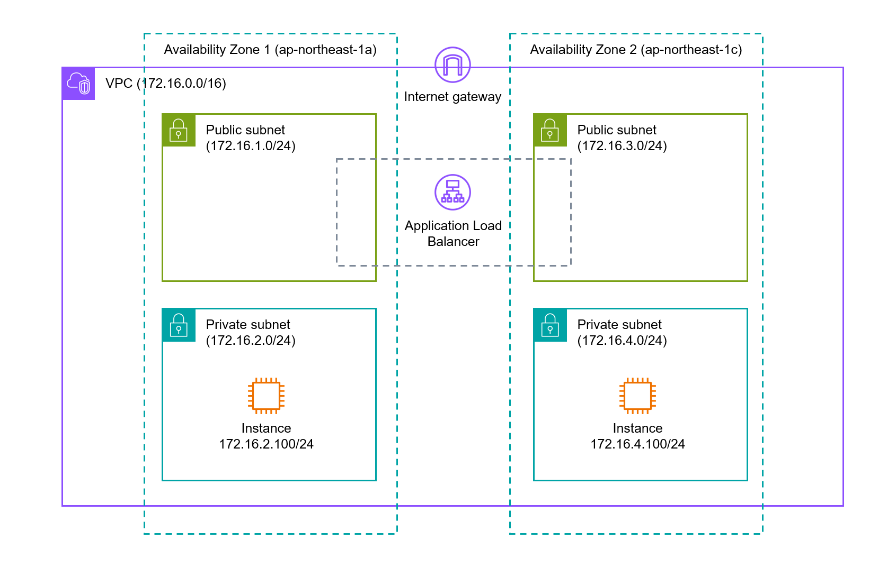

# Terraform で ALB を構築
- マルチ AZ で冗長化
- フロントのパブリックサブネットに ALB、バックエンドのプライベートサブネットに EC2 を置く構成

# 前提
- AWS アカウント、 IAM ユーザは作成
- aws configure を実行し AWS CLI に資格情報を設定
- ALB のターゲットグループのリスナーに HTTPS プロトコルを利用するため SSL サーバ証明書の登録をする
- サーバ証明書は IAM で管理する
- EC2 に登録する公開鍵はローカルで作成

# 構成図
